# TourismRecommendationSystem
基于Python旅游推荐系统带万字文档，基于Python+Django的旅游数据分析推荐系统带万字文档

### 完整项目获取

通过网盘分享的文件：基于Python实现的旅游推荐系统

链接: https://pan.baidu.com/s/1_YwBAc2Z50pLkzeQ3d2NAw?pwd=y6uk 提取码: y6uk
--来自百度网盘超级会员v3的分享

### 项目合集(项目不断更新中，包含java、vue、python、Android、微信小程序等项目)

链接: https://pan.baidu.com/s/1nY-zhvAK0CXYcn3g7LzQnQ?pwd=id3c 提取码: id3c
--来自百度网盘超级会员v3的分享

### 工具包

链接: https://pan.baidu.com/s/1YmdoJvkjoUjA75wvHLDZ6A?pwd=xm96 提取码: xm96
--来自百度网盘超级会员v3的分享

需要远程项目部署或项目修改和毕业设计也可联系（添加申请时请备注好来意）

### 远程调试部署联系方式

链接: https://pan.baidu.com/s/1W0dDcoZmayG0c7USJDYBYg?pwd=nqd7 提取码: nqd7
--来自百度网盘超级会员v3的分享

#### 这些项目一起发你了 可以分享给你需要的同学 调试可找我 也接二次修改和项目定制、毕业设计等

### 扫码关注公众号 获取更多项目和编程资料

关注公众号：小猿天天学习

公众号ID：xzzard

## 接毕业设计和论文

微信联系方式：xzxj0206  QQ：3808981644   (支持修改、 部署调试、 支持代做毕设)

接网站建设、小程序、H5、APP、各种系统等，单片机、嵌入式也可以做

选题+开题报告+任务书+程序定制+安装调试+论文+答辩ppt  都可以做

## 一、介绍

登录页面美化，添加验证码功能！

用户评论显示，可以了解每个用户去过的景点评论评分显示！

聚合分析，可以根据不同城市进行分析！

添加分页，老项目一次加载8000多景点数据，卡的一批，性能优化了一下。

最新数据：已爬取2025年3月旅游数据

[1]项目所用技术栈如下

后端： Django

开发语音：Python

数据库：MySQL

爬虫：requests 网络爬虫技术
推荐算法：机器学习

前端：BootStrap + ECharts

[2]功能说明

1用户系统：登录、注册、个人信息管理

2数据展示：旅游景点信息可视化呈现
3用户互动：景点评论、评分、反馈

4算法推荐：基于机器学习智能推荐景点

5数据分析：多维度统计旅游信息

6可视化图表：ECharts 图表展示

代码结构清晰，支持二次开发！

## 二、万字文档

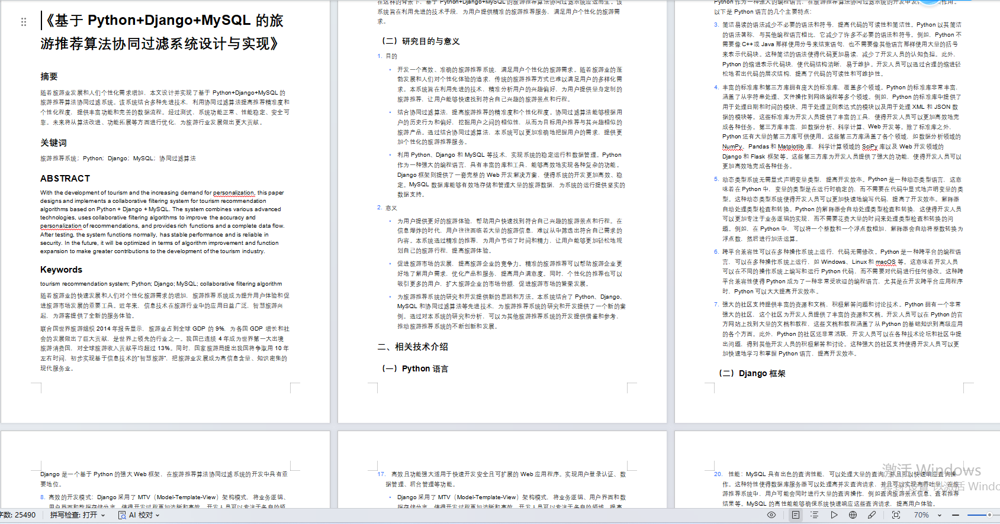

## 三、系统运行界面

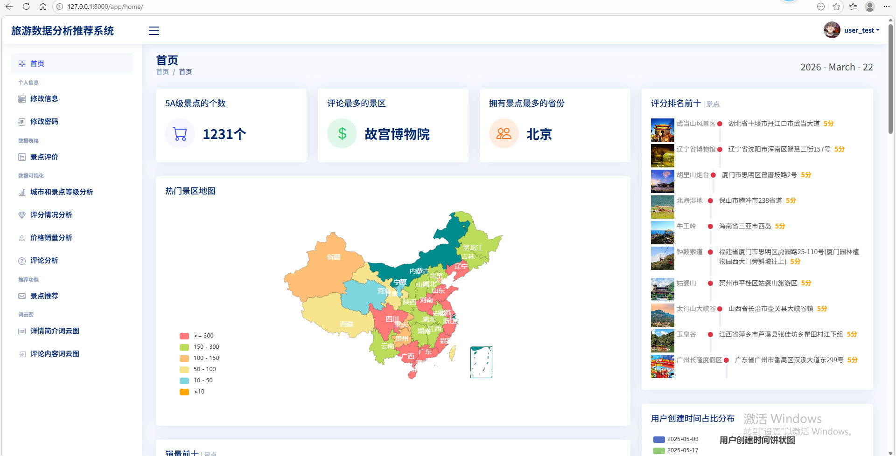

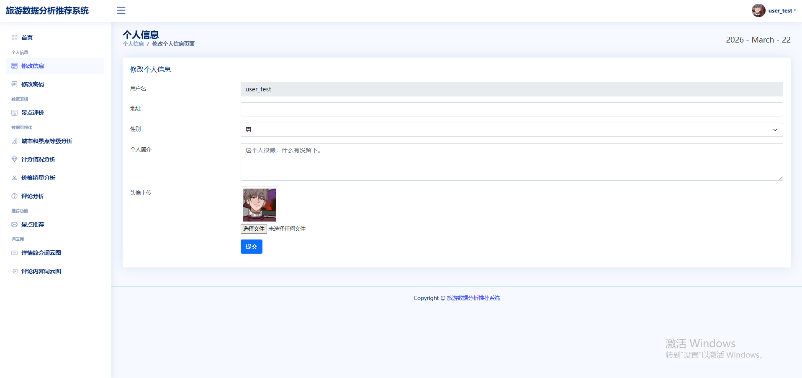

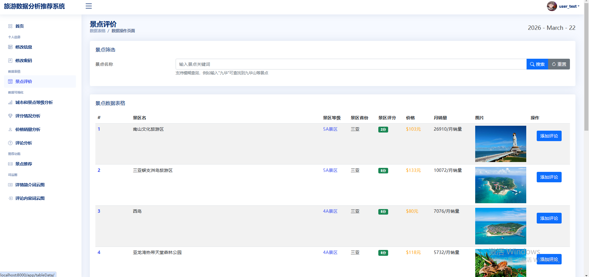

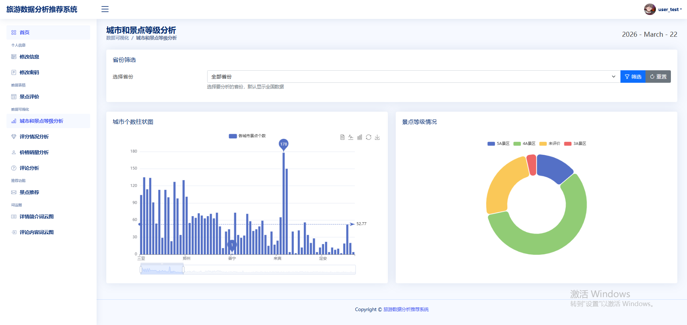

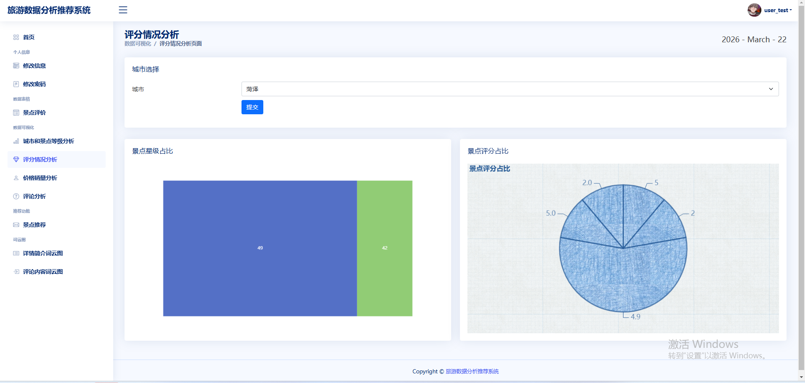

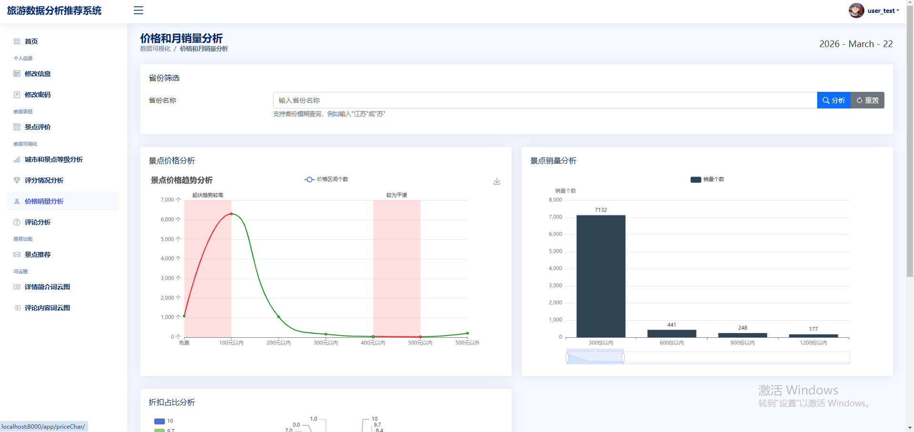

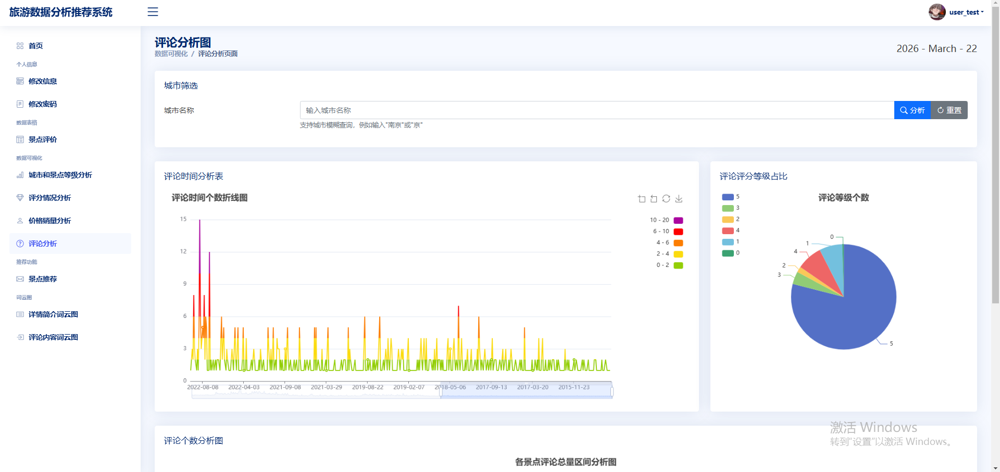

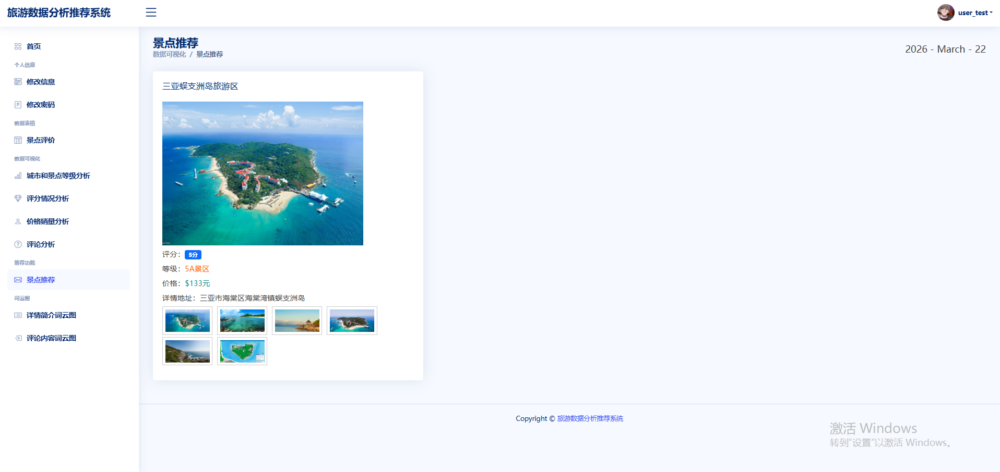

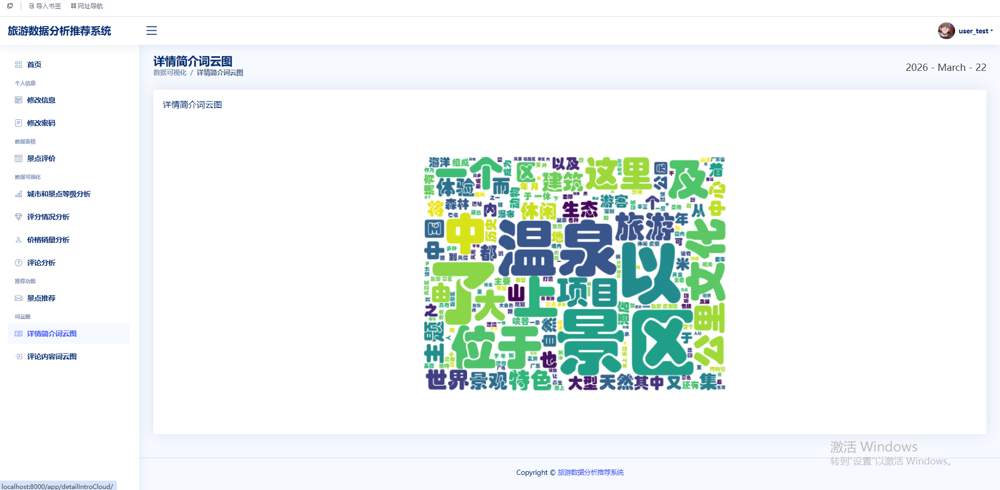

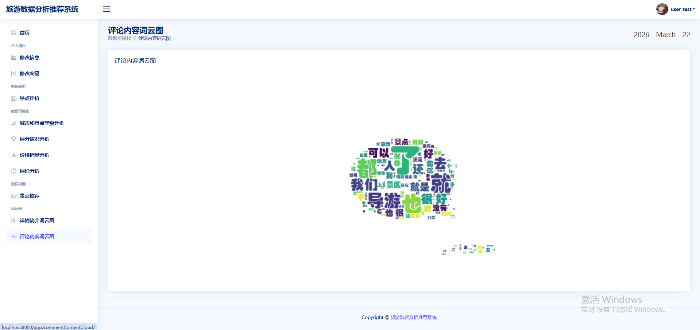

